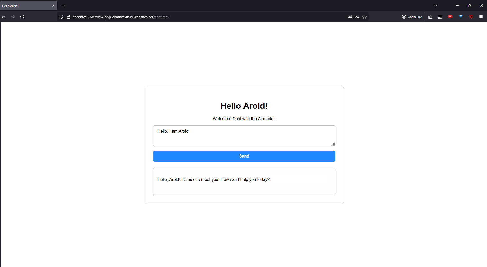

# t-systems-technical-interview

This repository demonstrates a simple pipeline that deploys a static website to Azure.

## Goals

- Deploy a minimal website that displays a greeting
- Automate the full deployment using a CI/CD pipeline (GitHub Actions)
- Use Azure as the hosting platform
- Parameterize the greeting text through an environment variable
- Add a chat feature to communicate with a LLM

## Overview and components

`.github/workflows/deploy.yml` : GitHub Actions workflow that automates deployment to Azure.

`deploy.sh` : executed by the workflow; script to automate deployment to Azure (using Azure CLI).

`index.html` : the static HTML page that displays the "Hello $GREETING_NAME!" greeting.

`chat.html` & `chat.php` : pages that implement a simple web-based chat using Openrouter's free Deepseek model.

`style.css` : common styling for the pages.

`phpinfo.php` : information about the PHP environment.

## Chat feature

Uses the deepseek/deepseek-chat-v3.1:free model via OpenRouter.

The feature consists of a textbox and a submit button. It sends the user's input to ``chat.php``, which itself produces the curl request to the LLM, using a preconfigured API key.
This architecture ensures that the API key is hidden to the user and is only available at runtime to the app service.

The frontend handling is managed with JavaScript.

## Prerequisites

1. Azure account and credentials
2. Github account to fork this repository

## Usage

Secrets :
- `AZURE_CLIENT_ID`
- `AZURE_CLIENT_SECRET`
- `AZURE_TENANT_ID`
- For chat branch feature : `OPENROUTER_API_KEY`

Variables :
- `GREETING_NAME` : Name to display on the website

### CI/CD Pipeline Explained

The deployment process is fully automated through the GitHub Actions workflow file: `.github/workflows/deploy.yml`.

**Trigger: every push to the branch starts the workflow.**

Steps:

1. Checkout the repository : 
The workflow first downloads the latest version of the repository code from GitHub so it can work with the most recent files.

2. Set Environment variables :
The pipeline loads all required secrets and variables. These are securely stored in GitHub and used during deployment.

3. Replace the greeting placeholder :
The command scans all project files for the text ``$GREETING_NAME`` and replaces it with the actual value defined in the repository variable.

4. Run the deployment script :
The workflow makes the deployment script (``deploy.sh``) executable and runs it.

This script uses the Azure CLI to:
- Authenticate with Azure using the provided credentials
- Create or update the Azure Web App
- Upload the website files (HTML, PHP, CSS, etc.) to the app service
- Configure the OpenRouter API Key for the service

The pipeline prints the final public URL.